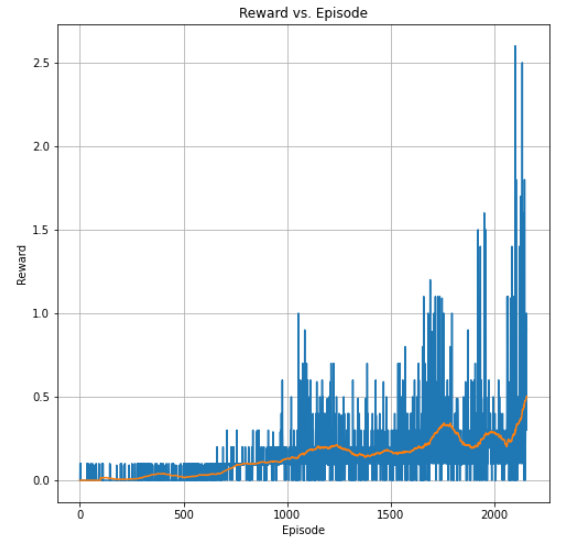

# MDDPG - Conlaboration/Competition  Project Report

This project implements DDPG algorithm to solve a multi player environment. The objective is to use this implementation
to train two players to play tennis in a collaborative manner.

In this environment, two agents control rackets to bounce a ball over a net. If an agent hits the ball over the net, 
it receives a reward of +0.1.  If an agent lets a ball hit the ground or hits the ball out of bounds,
it receives a reward of -0.01.  Thus, the goal of each agent is to keep the ball in play.

## DDPG Agents
To solve the environment, a single agent capable of observing both player's points of view is used. 
The agent learns how to act given each player point of view, and the critic also learns to estimate q from both points of view.
In this way, cooperation is guaranteed.

Both Actor and Critic uses support fixed targets, achieved by using two Networks, one for the targets and the other for 
the true learning.
Also, Replay Experiences is used to break the correlation existing between consecutive interactions in the environment, and to allow the use of multiple
agents interacting with their own environments. It is implemented using a Replace Buffer that stores experience tuples,
and which allows sampling them in batches to train the network.

## Network definitions
The Actor and Critic of both agents have the same architecture:
Actors consists of:
* two fully connected linear layers of `128`.
* The output layer outputs a `2` elements vector of values between `-1 and +1`. 
* For the three first layers, the activation function is `ReLU`. For the output layer, the activation is a `tanh`.
* The optimizer used was Adam.

Critics consists of:
* Two fully connected linear layers of `128`.
* An output fully connected linear layer of `1` units.
* For the three first layers, the activation function is `ReLU`. For the output layer, there is no activation.
* The optimizer used was Adam.

## Hyperparameters
The general hyper-parameters are:

* Actors learning rates: `1e-3`
* Critics learning rates: `1e-3`
* batch size: `128`
* Adam Optimizer
* MSE loss for the Critic
* Max number of episodes for training: `3000`
* Max number of steps per episodes: `1500`
* Discount Factor: `0.99`
* Tau: `1e-3` for the soft update of the target network parameters for both the Actor and the Critic

## Results
### DDPG Training output
The DDPG solved the environment in `2055` episodes with an average score of `0.5` over the last 100 episodes.

## Future work
* Implement other strategies such as Multi-agent DDPG or D4PG.
* Use Delayed Updates
* Use N step returns to reduce the variance during learning.
