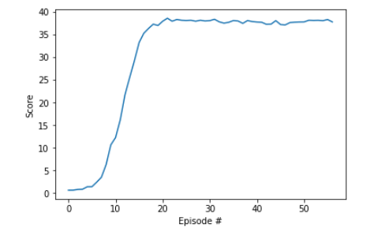

# DDPG - Continuous Control - Project Report

This project implements DDPG algorithm explained in the nanodegree. The objective is to use this implementation
to train an agent to control the moves on a 2 jointed arm.

In this environment, a reward of +0.1 is provided for each step that the agent's hand is in the goal location.
Thus, the goal of your agent is to maintain its position at the target location for as many time steps as possible.

## DDPG Agent
The agent interacts with the environment to maximize te reward. The implementation of the DDPG is based on a Actor-Critic architecture,
where the Critic act as a baseline used to predict the Q-values, and the Actor will use those Q-value predictions to improve the policy
followed by the agent.

Both Actor and Critic uses support fixed targets, achieved by using two Networks, one for the targets and the other for 
the true learning.
Also, Replay Experiences is used to break the correlation existing between consecutive interactions in the environment, and to allow the use of multiple
agents interacting with their own environments. It is implemented using a Replace Buffer that stores experience tuples,
and which allows sampling them in batches to train the network.

## Network definitions

The Actor consists of:
* Two fully connected linear layers of `128` units each.
* The output layer outputs a `4` elements vector of values between `-1 and +1`. 
* For first and second layers, the activation function is `ReLU`. For the output layer, the activation is a `tamh`.
* The optimizer used was Adam.

The Critic consists of:
* A first fully connected linear layer of `128` units.
* A concatenation of the output of the first layer with a `4` elements vector corresponding to the action taken by the Actor
* A second fully connected linear layer of `128` units.
* An output fully connected linear layer of `1` units.
* For the first and second layers, the activation function is `ReLU`. For the output layer, there is no activation.
* The optimizer used was Adam.

## Hyperparameters

The general hyper-parameters are:

* Actor learning rate: `1e-3`
* Critic learning rate: `1e-3`
* batch size: `128`
* Adam Optimizer
* MSE loss for the Critic
* Max number of episodes for training: `1000`
* Max number of steps per episode: `1000`
* Discount Factor: `0.99`
* Tau: `1e-3` for the soft update of the target network parameters for both the Actor and the Critic
* Learn frequency: `1`, the network is updated every 1 interactions with the environment

## Results
### DDPG Training output
The DDPG solved the environment in `57` episodes with an average score of `30.03` over the last 100 episodes.

### Future work
- Implement other strategies such as A3C, A2C or D4PG.
- Use Delayed Updates
- Use N step returns to reduce the variance during learning.
