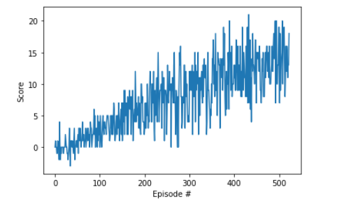

# DQN - Banana Navigation - Project Report

This project implements Deep Q-Learning algorithm explained in the nanodegree. The objective is to use this implementation
to train an agent to navigate (and collect bananas!) in a large, square world.

In that environment, A reward of +1 is provided for collecting a yellow banana, and a reward of -1 is provided for 
collecting a blue banana.  Thus, the goal of your agent is to collect as many yellow bananas as possible while avoiding blue bananas. 
To do so, the agent uses an embedding of the state of the game, represented by a vector of 37 values. 

## DQN Agent
The agent interacts with the environment to maximize te reward. The implementation of the DQN Agent support fixed targets,
achieved by using two QNetworks, one for the targets and the other for the true learning, which stabilizes the training.
Also, Replay Experiences is used to break the correlation existing between consecutive interactions in the environment.
It is implemented using a Replace Buffer that stores experience tuples, and which allows sampling them in batches to train the network.

## Network definition

* Two fully connected linear layers of `64` units each.
* The output layer outputs a `4` elements vector, corresponding to the 4 possible actions. 
* For first and second layers, the activation function is `ReLU`. For the output layer, there is no activation.
* The optimizer used was Adam with its default values.

## Hyperparameters

The general hyper-parameters are:

### Neural Network training hyperparameters

* learning rate: `5e-4`
* batch size: `64`
* Adam Optimizer
* MSE loss

### Q-Learning parameters
* Max number of episodes for training: `2000`
* Max number of steps per episode: `1000`
* Initial $\epsilon$ (epsilon): `1.0`
* Minimal $\epsilon$ : `0.01`
* $\epsilon$ decay: `0.995`
* Tau: `1e-3` for the soft update of the target network parameters 
* Learn frequency: `4`, the network is updated every 4 interactions with the environment

## Results
### DQN Training output
The DQN solved the environment in `523` episodes with an average score of `13.01` over the last 100 episodes.

### Future work
- Implement other DQN improvements such as Dueling Q-Network and prioritized experience replay.
- Solve the task using raw pixels.

### References
- Udacity - Deep Reinforcement Learning - Nano Degree: https://www.udacity.com/course/deep-reinforcement-learning-nanodegree--nd893
- Human-level control through deep reinforcement
learning: http://www.nature.com/articles/nature14236
- Deep Reinforcement Learning with Double Q-learning: http://arxiv.org/abs/1509.06461